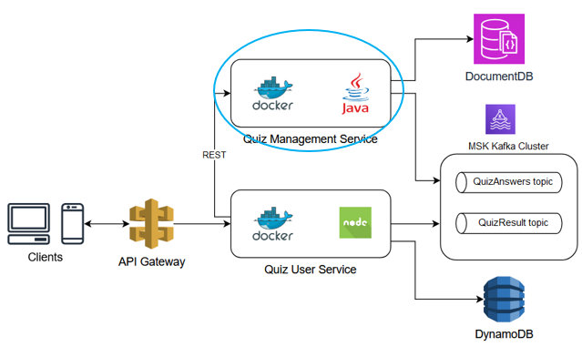
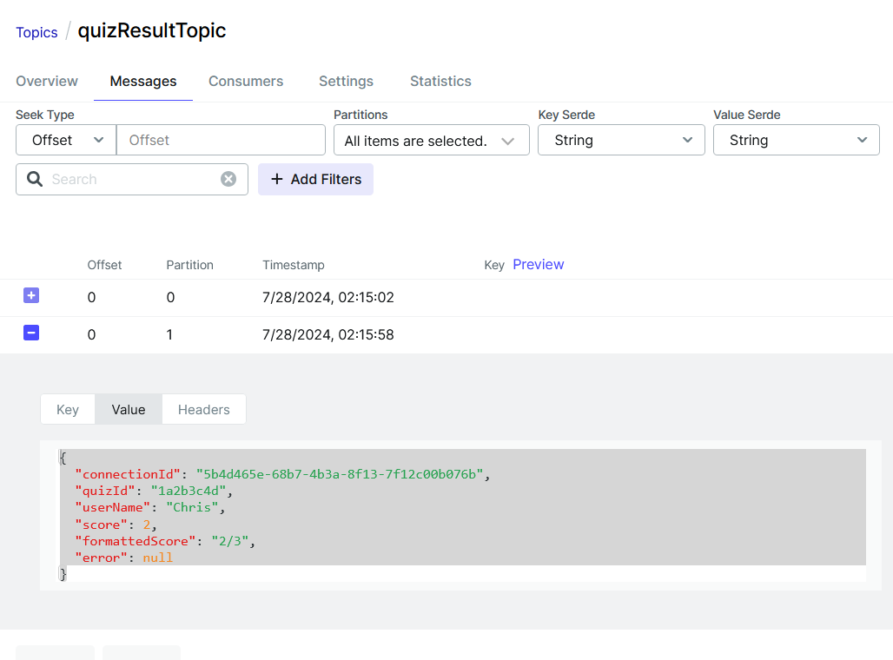

# Introduction

**Quiz Management Service** is a Java application to implement a real-time Quiz feature in an existing English learning application. 
This service utilizes **Spring Reactive** to enhance performance, scalability, and resilience. It acts as a downstream service with the following capabilities:
- Managing quizzes which are stored in MongoDB, this service exposes some REST APIs interact with a Quiz via Quiz ID.
- Consume **QuizAnswers** messages which published by the **Quiz User Service** to Kafka then calculates scores and publish a **QuizResult** message.
- Handling all communication with other downstream services for syncing quiz data or tracking results (not in scope of this project now).



## Tech stack

JDK 17, Gradle, Spring 6, Spring Cloud Stream, Spring Webflux, Kafka, Docker Compose, Mongodb

## Project structure
    .
    ├── docker                    
    ├──── mongo-init.js           # contain a script to create needed collections and create test data
    ├──── docker-compose.yml      # build up MySQL containers and initiate needed databases
    ├── src                       
    ├──── main                    
    ├────── java                  # contain all source code
    ├────── resource              # contain application configuration about database connection and kafka binders
    ├──── test                    
    ├────── java                  # contain all tests

## How to get started?
We need to build up MongoDB and Kafka with a Zookeeper, a broker and two topics using docker-compose which will also 
create 10 quizzes with some questions by default for development purpose.
```shell
docker-compose up
```
We can start this service via below gradle commands.
```shell
gradle build
gradle bootRun
```
We can start integration tests of the service that build up MongoDB and Kafka containers 
before running test and then remove them after finishing test automatically:
```shell
gradlew build
gradlew clean test
```

##  Reactive REST APIs
Two REST APIs are exposed by this service to interact with quiz data.
1. API to check if a Quiz ID is exists and ready to join. Example call:
```shell
curl --location --request GET 'http://localhost:8084/quiz-mng-service/quiz/1a2b3c4d3/exists'
```
2. API to get quiz data by Quiz ID. Example call:
```shell
curl --location --request GET 'http://localhost:8084/quiz-mng-service/quiz/1a2b3c4d3'
```

##  Consume quiz answers
For instance, there is a quiz with Quiz ID is "1a2b3c4d" and 3 questions, _correct_answer_ field indicates the index
of the correct answer in the _answers_ array field (e.g the correct answer of question 1 is "Paris")
```shell
{
    "question_id" : NumberDecimal("1"),
    "question" : "What is the capital of France?",
    "answers" : [ 
        "Berlin", 
        "Madrid", 
        "Paris", 
        "Rome"
    ],
    "correct_answer" : 2
}, 
{
    "question_id" : NumberDecimal("2"),
    "question" : "Which planet is known as the Red Planet?",
    "answers" : [ 
        "Earth", 
        "Mars", 
        "Jupiter", 
        "Saturn"
    ],
    "correct_answer" : 1
}, 
{
    "question_id" : NumberDecimal("3"),
    "question" : "Who wrote 'Romeo and Juliet'?",
    "answers" : [ 
        "William Shakespeare", 
        "Charles Dickens", 
        "Mark Twain", 
        "Jane Austen"
    ],
    "correct_answer" : 0
}
```
Quiz answer is published by the **Quiz User Service** but we can test it by using a Kafka UI container connecting
to our Kafka cluster, it is built up and exposed to port 8088 by the docker-compose file.

After starting this service, let access to http://localhost:8088 and produce a message to **quizAnswersTopic**
with the below data.
```shell
{
    "connectionId": "5b4d465e-68b7-4b3a-8f13-7f12c00b076b",
    "userName": "Chris",
    "quizId": "1a2b3c4d",
    "answers": [
        {
            "questionId": 1,
            "answer": 2
        },
        {
            "questionId": 2,
            "answer": 1
        },
        {
            "questionId": 3,
            "answer": 1
        }
    ]
}
```
This message will be processed by the Quiz Management Service, with the result being published 
to the QuizResult topic and monitored through the Kafka UI.

This result indicates that the user answered 2 out of 3 questions correctly.